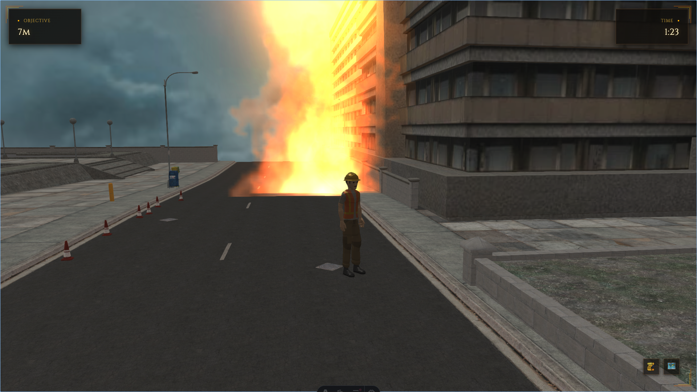
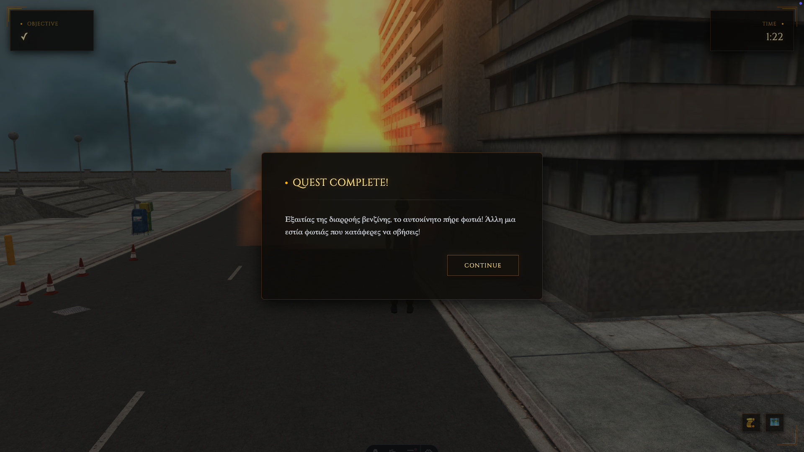
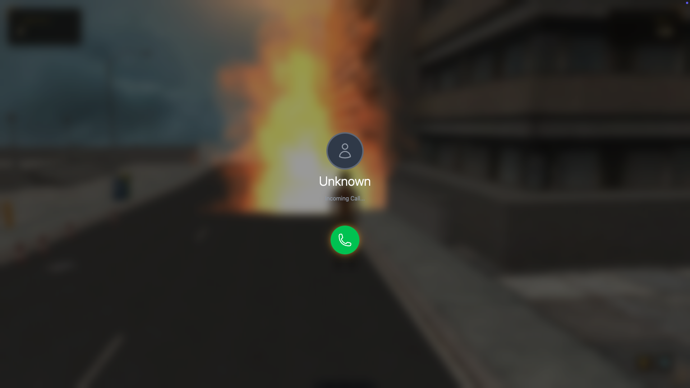
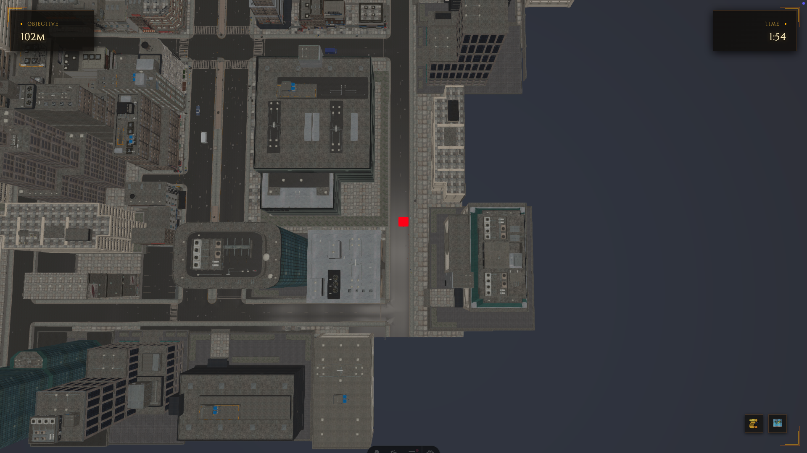

# 🔥 Fire Escape: Save the City

## 🚒 Project Description

In the heart of the city, an unseen threat flickers to life. A series of mysterious fires are breaking out, and only you, a CP Ranger, can stop the devastation. "Fire Escape: Save the City" is an immersive 3D action game that puts you in the boots of a modern-day hero.

Your mission is to navigate through the city streets in third-person view, guided by cryptic riddles delivered through phone calls. Each riddle points to a fire location. You must decipher the clues, locate the fire on the map, and race against time to reach it. With realistic physics, smooth character movement, and atmospheric lighting, every second counts as you fight to save the city before it's too late.

## 🎮 Screenshots

### Third-Person Gameplay

*Navigate the city streets in cinematic third-person view with smooth character controls*

### Quest Complete

*Complete objectives and receive new missions through an elegant Elden Ring-inspired UI*

### Incoming Mission Call

*Receive urgent mission calls with critical information about fire locations*

### Top-Down Map View

*Switch to tactical map view to get your bearings and teleport across the city*

## ✨ Features

- **Immersive 3D Environment:** Explore a realistic city with cinematic lighting, dynamic fog, and time-based atmosphere
- **Third-Person Character Control:** Smooth movement with physics-based locomotion, sprint, jump, and directional animations
- **Quest System:** Solve cryptic riddles delivered through phone calls to locate fires
- **Dual Camera System:** Switch between third-person gameplay and tactical top-down map view
- **Timer-Based Challenges:** Race against time (2 minutes per quest) to complete objectives
- **Interactive HUD:** Minimalist Elden Ring-inspired UI showing distance to objective and remaining time
- **Cinematic Cutscenes:** Dynamic camera transitions and character animations for quest completion
- **Professional Visuals:** Post-processing effects including bloom, tone mapping, film grain, and depth of field
- **Audio Atmosphere:** Procedural background music, fire sound effects with spatial audio, and UI sound feedback

## 💻 Technologies Used

- **Framework:** [Astro](https://astro.build/)
- **3D Engine:** [Babylon.js](https://www.babylonjs.com/) with WebGPU support
- **Physics:** Havok Physics Engine
- **Audio:** [Tone.js](https://tonejs.github.io/) for procedural audio generation
- **Styling:** Tailwind CSS + DaisyUI
- **Language:** [TypeScript](https://www.typescriptlang.org/)

## 🎯 How to Play

1. **Start the Game:** The first quest will appear after a brief intro
2. **Answer the Call:** Receive a phone call with a cryptic riddle about a fire location
3. **Read the Riddle:** Carefully analyze the clue to determine where the fire might be
4. **Navigate the City:** Use WASD to move, Shift to sprint, Space to jump, and mouse to rotate camera
5. **Check the Map:** Press the map button to switch to top-down view and click to teleport
6. **Find the Fire:** Follow the distance indicator in the HUD to locate the fire
7. **Complete the Quest:** Reach the fire location within the time limit to extinguish it
8. **Repeat:** Successfully complete all quests to save the city!

### Controls

- **W/A/S/D** - Move character
- **Shift** - Sprint
- **Space** - Jump
- **Mouse** - Rotate camera
- **Map Button** - Toggle map view (bottom right)
- **Info Button** - Review current quest (bottom right)

## 🚀 Getting Started

```bash
# Install dependencies
npm install

# Run development server
npm run dev

# Build for production
npm run build
```

## 🎨 Game Features

### Character System
- Smooth physics-based movement with velocity lerping
- Directional animations (walk, run, sprint, jump, idle)
- Camera-relative controls for intuitive gameplay
- Dynamic character rotation based on movement direction

### Quest Management
- 5 unique quests with cryptic riddles
- Phone call system for mission delivery
- Distance tracking to objectives
- Quest completion cinematics

### Visual Effects
- Time-based dynamic lighting (changes based on real-world time)
- Atmospheric fog with distance-based density
- Glowing sun with bloom effects
- Post-processing pipeline with film grain and color grading
- Fire particle effects with color gradients

### Audio Design
- Procedural background music with tense cinematic themes
- Spatial fire sound effects that scale with distance
- UI sound feedback for buttons and interactions
- Phone ringtone for incoming calls
- Quest completion fanfare

## 🏗️ Architecture

The game is built with a modular architecture:

- **Game.ts** - Core game loop and state management
- **Player.ts** - Character controller with physics and animations
- **World.ts** - Environment, lighting, and world object management
- **GameCamera.ts** - Camera system with multiple view modes
- **QuestManager.ts** - Quest progression and state tracking
- **UIManager.ts** - HUD and modal management
- **AudioManager.ts** - Procedural audio generation and playback

## 📝 License

MIT License - Feel free to use this project for learning and inspiration!

---

Built with ❤️ using Astro, Babylon.js, and modern web technologies
